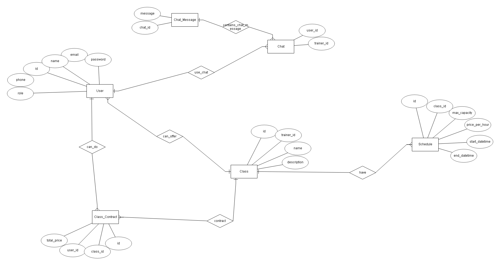

# 📌 Proyecto: PeakZone / BookZone (Nombre por definir)

## 👥 Autores del Proyecto:
✍️ *(Gálvez Madueño, Alejandro - Muñoz Marín, Manuel José)*

---

## 📖 Descripción del Proyecto

Este proyecto consiste en un servidor que proporcionará información y almacenamiento a una página web y una aplicación multiplataforma. Está dirigido a gestores de gimnasios y entrenadores personales para que puedan ofrecer sus servicios en forma de clases o entrenamientos personalizados. Los usuarios podrán reservar estos servicios y gestionar sus actividades deportivas de manera fácil y eficiente.

🔹 **Características principales:**
- Los servicios se podrán ofertar desde la web y la app para usuarios con el rol de administrador.
- Los usuarios con rol "user" podrán reservar servicios disponibles y consultar sus reservas previas.
- Envío de recordatorios antes de cada clase. ⏰
- Chat disponible para comunicación con el administrador del servicio reservado. 💬
- Posibilidad de chat grupal para las personas que participan en la misma actividad.

🔸 **Opcionales en estudio:**
- Implementación de pagos. 💳
- Búsqueda global o por centro/entrenador específico.

---

## 🎯 Objetivos del Proyecto

### ✅ Principal:
- 🏋️ Aplicación multiplataforma para la administración de reservas de actividades deportivas.
- 🗣️ Interacción con los entrenadores mediante chats en la app.

### 🔹 Secundarios:
- 🤖 Implementación de IA generativa para la creación de rutinas personalizadas.
- 📊 Seguimiento de marcas y generación de gráficas de rendimiento.

---

## 🛠️ Tecnologías Utilizadas

🌐 **Frontend Web:** React 

📱 **Aplicación Móvil:** React Native 

🔗 **Backend:** Spring Boot 

📦 **Base de Datos:** *(Esquema E/R adjunto)*

---

## 🎨 Diseño 
  
🔗 [Ver diseño en Figma](https://www.figma.com/design/yxJJMhDoufw6WK8nBnkZd3/Aplicaci%C3%B3n-gestion-gym?node-id=11-547&t=IyhWAoJk5Y5FJ5Dw-0)

🚀 **¡En desarrollo!** 

