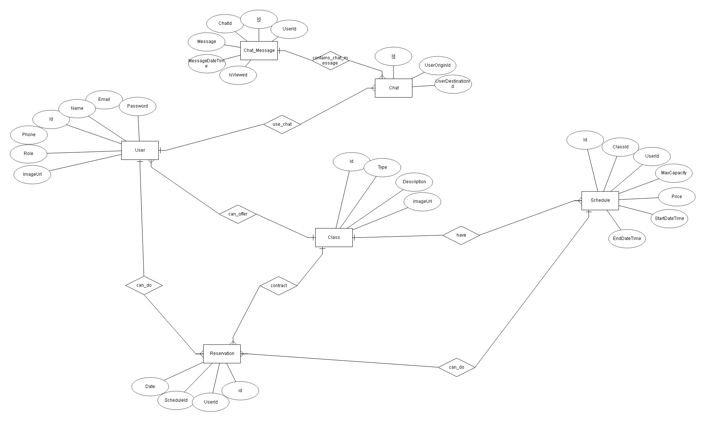

# TrainingZone

## Índice

- [Autores del Proyecto](#autores-del-proyecto)
- [Descripción](#descripción)
- [Objetivos del Proyecto](#objetivos-del-proyecto)
- [Tecnologías Utilizadas](#tecnologías-utilizadas)
- [Base de Datos](#base-de-datos)
- [Despliegue](#despliegue)
- [Diseño de la Aplicación](#diseño-de-la-aplicación)
- [Tutorial de Uso](#tutorial-de-uso)
- [Presentación PDF](#presentación-pdf)
- [Bitácora de Tareas](#bitácora-de-tareas)
- [Bibliografía](#bibliografía)
- [Vídeo del Proyecto](#vídeo-del-proyecto)

---

## Autores del Proyecto

*(Gálvez Madueño, Alejandro - Muñoz Marín, Manuel José)*

---

## Descripción

Este proyecto consiste en un servidor que proporcionará información y almacenamiento a una página web y una aplicación multiplataforma. Está dirigido a gestores de gimnasios y entrenadores personales para que puedan ofrecer sus servicios en forma de clases o entrenamientos personalizados. Los usuarios podrán reservar estos servicios y gestionar sus actividades deportivas de manera fácil y eficiente.

**Características principales:**

- Vistas de entrenadores, clases, usuario actual y administración de estas
- Vistas adaptadas según el rol (user/admin)
- Chat en tiempo real con los entrenadores
- Sistema de almacenamiento de imágenes en servidor
- Persistencia local para crear rutinas generadas por IA
- Idioma inglés/español
- Tema claro y oscuro

**Opcionales en estudio:**

- Implementación de pagos

---

## Objetivos del Proyecto

**Principal:**

- Aplicación multiplataforma para gestionar reservas deportivas
- Interacción entre usuarios y entrenadores
- Generación de rutinas mediante IA

---

## Tecnologías Utilizadas

- **Frontend Web:** React
- **Aplicación Móvil:** React Native
- **Backend:** ASP .NET core
- **Base de Datos:** SQLite en desarrollo | MySQL en producción

---

## Base de Datos

Esquema E/R utilizado:

---

## Diseño de la Aplicación

[Ver diseño en Figma](https://www.figma.com/design/yxJJMhDoufw6WK8nBnkZd3/Aplicaci%C3%B3n-gestion-gym?node-id=11-547&t=IyhWAoJk5Y5FJ5Dw-0)

---

## Tutorial de Uso

*Aquí irán capturas de pantalla, instrucciones paso a paso, y demostraciones del uso de la aplicación.*

> ⚠️ **En desarrollo.**

---

## Despliegue

### WEB

[Ver](https://training-zone-final.vercel.app)

### Android (APK):

[Descargar APK](https://drive.google.com/file/d/1mZhf6vSjB8J9pnyOHAFvkeCu--3yySLC/view?usp=sharing)

> Instálala manualmente en tu dispositivo Android. Es posible que necesites habilitar la instalación desde "fuentes desconocidas".

### iOS (solo emulador):

[Descargar iOS (.tar.gz)](https://drive.google.com/file/d/1ZLtSCgYWWa9QkLjk5U3iGSPONtbsoyZo/view?usp=drive_link)

> Actualmente, la versión iOS **solo funciona en simuladores (Xcode)** y **no puede instalarse en iPhones físicos sin una cuenta de desarrollador de Apple**.
---

## Presentación PDF

---

## Bitácora de Tareas

[Ver Bitácora en Notion](https://orchid-bill-0c6.notion.site/1cb62914266b803d8ba3f6f4a7f7235c?v=1cb62914266b807c81a3000c3464d94a)

---

## Bibliografía

[Ver bibliografía en Notion](https://orchid-bill-0c6.notion.site/1cb62914266b80b297c4c8b4fdd877e8?v=1cb62914266b80e7b13f000ca548157e)

---

## Vídeo del Proyecto
[ver vídeo en Vimeo](https://vimeo.com/1080301345/d42ce29c58?share=copy)

[vídeo proyecto terminado](https://vimeo.com/1093243718/4a2d4f3380?share=copy)
